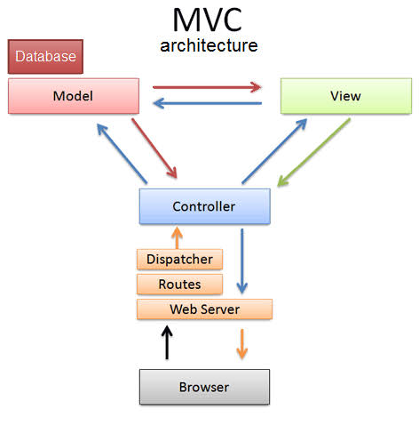
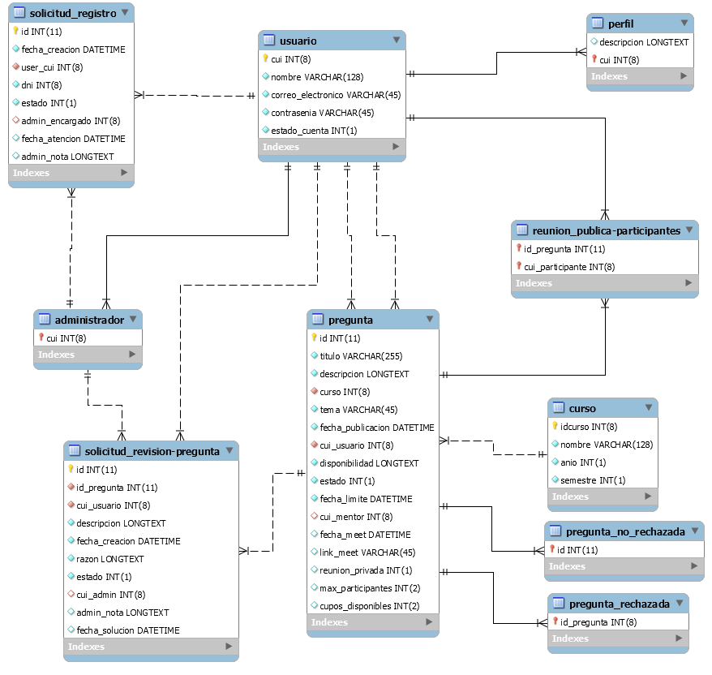

# PROYECTO FINAL - INGENIERÍA DE SOFTWARE III

### 

## Integrantes
Jim Leonardo Huertas Canaza

Dennis Pumaraime Espinoza

Solange Aracely Romero Chacón

Santiago Javier Vilca Limachi

Luisa Villanueva Guerrero

## Sobre Tasti
Este software se basa en una idea sencilla: si un estudiante tiene dificultades para aprender sobre un tema específico puede postearlo en un foro y, por otra parte, si algún estudiante de años superiores ve esta publicación y conoce sobre el tema requerido puede ofrecerse para realizar un reforzamiento vía online a esta persona sobre ese tema.

Tasti es un intermediario para que ambas personas puedan reunirse por medio de una conferencia enlace meet, además de permitir a otros estudiantes con dudas similares permitir unirse a la presente explicación, en caso el tutor desee, en caso contrario siempre el tutor podrá dar una clase privada a su aprendiz.

**Herramientas utilizadas:** 

FrontEnd: Html5 - CSS 

BackEnd: PHP

**Prototipo:** https://www.figma.com/file/7NOEbTe5UWg6VplKkzYTtL/Untitled?node-id=0%3A1

**Trello:** https://trello.com/invite/b/caSCHagM/4905f46ea8016a2aa74da6e0047c2e8c/tasti

## Arquitectura

## Modelo Entidad-Relacion

## Requisitos Funcionales

* **Mostrar preguntas disponibles**, el sistema debe mostrar en la página principal y sin la necesidad de registrarse, toda la información de las preguntas disponibles.
* **Registro de un usuario**, deberá ingresar su correo institucional, una contraseña y su CUI. Este formulario será enviado como una solicitud de registro a los moderadores para verificar los datos y permitir registro.
* **Inicio de sesión de usuario**, los usuarios deben de identificarse para acceder a las funcionalidades de la página, ya sea para recibir o dar clases, recibiendo el rol de estudiante o mentor respectivamente.
* **Perfil de usuario**, un usuario puede agregar información como una descripción, el año que curso o si es egresado. También se mostrará una sección “Mis preguntas” donde podrá visualizar las preguntas realizadas realizadas o en las que es mentor.
* **Buscar por filtro**, el sistema permite filtrar los temas por nombre de la asignatura correspondiente.
* **Formulario de preguntas**, el sistema tendrá un formulario para que los usuarios puedan colocar preguntas, definir la asignatura a la que corresponde y los horarios en el que puede recibir la mentoría y la fecha límite para recibir una respuesta. Las preguntas se podrán visualizar en la página principal.
* **Vista general de pregunta**, una pregunta puede ser tomada por cualquier usuario (mentor). El mentor debería establecer un horario y definir si desea hacer la mentoría 1 a 1 con el usuario aprendiz o realizar una mentoría grupal con otros usuarios interesados (de manera opcional puede definir un límite de participantes). Luego de esto el usuario dueño de la pregunta debería confirmar si está de acuerdo con los términos del usuario mentor.
* **Cierre de la pregunta**, una vez el estudiante haya encontrado un tutor el cual le apoye en el área correspondiente la pregunta se cerrará evitando que algún otro tutor interesado tome la enseñanza del tema.
* **Unirse a una mentoría**, un usuario ajeno a la pregunta puede solicitar unirse en caso la opción de mentoría grupal esté disponible y haya cupos disponibles, solo así se mostrará el link del meet.
* **Creación automática de los links de meet**, una vez el mentor haya elegido un horario establecido junto a su aprendiz correspondiente. En caso el mentor desee compartir su clase a más estudiantes además de su aprendiz, podrá colocar el link como público, y permitir el ingreso a otras personas también interesadas en el tema.

## Requisitos no funcionales
#### Rendimiento
* Las interfaces del sistema deben de cargar en menos de 3 segundos cuando el número de usuarios simultáneos es mayor a 10 000
* Los datos modificados en la base de datos deben ser actualizados para todos los usuarios que acceden en menos de 2 segundos.
* El sistema debe ser capaz de realizar validaciones del usuario, soportar el acceso de múltiples usuarios y sus consultas con respecto a la información simultáneamente sin reducir su rendimiento.
#### Seguridad
* Uso de contraseñas para cada usuario. Esto permitirá que tengan acceso al sistema solo las personas que tienen autorización, a través de la validación de sus datos y mostrando mensajes de error.
* Registros de ingreso al sistema.
* Creación de roles y asignarlos a cada usuario dependiendo su funcionalidad.
#### Disponibilidad
* La disponibilidad del sistema será 24 horas al día, 7 días a la semana, de tal manera que el usuario pueda acceder a la información que requiera a cualquier hora del día sin ninguna complicación.
#### Usabilidad
* El sistema debe contar con un diseño responsivo gráfico bien formado, claro, eficiente y amigable al usuario.
* Un nuevo usuario no debería tardar más de 120 segundos en registrarse.
* Un usuario registrado no debería tardar más de 150 segundos en acceder a la información que desee.
#### Estándar
* El idioma por defecto es el español.
#### Portabilidad
* El sistema será implantado bajo la plataforma de Windows.

## Plan de Prueba 

####Personas involucradas / Responsabilidades
**Usuario 1:** Luisa Villanueva : Frontend, Backend
**Usuario 2:** Solange Romero: Frontend, Bases de datos
**Usuario 3:** Jim Huertas: Frontend
**Usuario 4:** Santiago Vilca: Backend 
**Usuario 5:** Dennis Pumaraime: Backend

####Equipo / Software
El sistema debe funcionar como una aplicación web, con acceso mediante un ordenador. 

####Cronograma
Fecha de inicio y fin de proyecto: 29 de Junio de 2020 - 12 de Agosto de 2022 
Fecha de inicio y fin de pruebas: 13 de Agosto de 2022 - 20 de Agosto del 2022

####Sitio de pruebas
El sistema no posee un local específico para las pruebas. Los mismos serán ejecutados en las máquinas de las personas involucradas. 

####Criterios para considerar finalizada una prueba
Una prueba será considerada como finalizada al llenar la columna del resultado de la prueba en el documento de casos de prueba, como “ejecutado con éxito”. 

####Casos de Prueba
<table border=0 cellpadding=0 cellspacing=0 width=581 style='border-collapse:
 collapse;table-layout:fixed;width:434pt'>
 <col width=83 span=7 style='width:62pt'>
 <tr height=20 style='height:15.0pt'>
  <td colspan=7 height=20 class=xl6829111 width=581 style='border-right:1.0pt solid black;
  height:15.0pt;width:434pt'>Casos de Prueba</td>
 </tr>
 <tr height=20 style='height:15.0pt'>
  <td colspan=7 height=20 class=xl6829111 width=581 style='border-right:1.0pt solid black;
  height:15.0pt;width:434pt'>Tasti</td>
 </tr>
 <tr height=28 style='height:21.0pt'>
  <td height=28 class=xl6329111 width=83 style='height:21.0pt;border-top:none;
  width:62pt'>ID</td>
  <td class=xl6329111 width=83 style='border-top:none;border-left:none;
  width:62pt'>Módulo</td>
  <td class=xl6329111 width=83 style='border-top:none;border-left:none;
  width:62pt'>Descripción</td>
  <td class=xl6329111 width=83 style='border-top:none;border-left:none;
  width:62pt'>Pasos</td>
  <td class=xl6329111 width=83 style='border-top:none;border-left:none;
  width:62pt'>Resultado esperado</td>
  <td class=xl6329111 width=83 style='border-top:none;border-left:none;
  width:62pt'>Resultado del desarrollador</td>
  <td class=xl6329111 width=83 style='border-top:none;border-left:none;
  width:62pt'>Resultado de la prueba</td>
 </tr>
 <tr height=41 style='height:30.6pt'>
  <td rowspan=3 height=137 class=xl6429111 align=right width=83
  style='border-bottom:1.0pt solid black;height:102.6pt;border-top:none;
  width:62pt'>1</td>
  <td rowspan=3 class=xl6429111 width=83 style='border-bottom:1.0pt solid black;
  border-top:none;width:62pt'>Registro de Usuario</td>
  <td rowspan=3 class=xl6429111 width=83 style='border-bottom:1.0pt solid black;
  border-top:none;width:62pt'>Enviar solicitud de registro de usuario,
  administrador supervisa y aprueba o desaprueba.</td>
  <td class=xl6429111 width=83 style='border-top:none;border-left:none;
  width:62pt'>1. Escoger la opción “Registrarse”.</td>
  <td rowspan=3 class=xl6429111 width=83 style='border-bottom:1.0pt solid black;
  border-top:none;width:62pt'>Envío de registro a administradores con éxito, a
  espera de que sea aprobado o desaprobado.</td>
  <td rowspan=3 class=xl6429111 width=83 style='border-bottom:1.0pt solid black;
  border-top:none;width:62pt'>Usuario 5 - 2022/08/11 Ejecutado con éxito.</td>
  <td rowspan=3 class=xl6429111 width=83 style='border-bottom:1.0pt solid black;
  border-top:none;width:62pt'>Usuario 4 - 2022/08/12 Ejecutado con éxito.</td>
 </tr>
 <tr height=54 style='height:40.8pt'>
  <td height=54 class=xl6529111 width=83 style='height:40.8pt;border-left:none;
  width:62pt'>2. Llenar los datos correspondientes.</td>
 </tr>
 <tr height=42 style='height:31.2pt'>
  <td height=42 class=xl6629111 width=83 style='height:31.2pt;border-left:none;
  width:62pt'>3. Click en botón Registrarse.</td>
 </tr>
 <tr height=96 style='height:72.0pt'>
  <td height=96 class=xl6329111 align=right width=83 style='height:72.0pt;
  border-top:none;width:62pt'>2</td>
  <td class=xl6329111 width=83 style='border-top:none;border-left:none;
  width:62pt'>Mostrar preguntas por categoría</td>
  <td class=xl6329111 width=83 style='border-top:none;border-left:none;
  width:62pt'>Filtrar preguntas de la DB de acuerdo a categorías
  preestablecidas.</td>
  <td class=xl6329111 width=83 style='border-top:none;border-left:none;
  width:62pt'>1. En menú principal, clic sobre una de las categorías
  preestablecidas.</td>
  <td class=xl6329111 width=83 style='border-top:none;border-left:none;
  width:62pt'>Se debe filtrar las preguntas de acuerdo a la categoría con la
  que fueron guardadas anteriormente</td>
  <td class=xl6329111 width=83 style='border-top:none;border-left:none;
  width:62pt'>Usuario 5 - 2022/08/11 Ejecutado con éxito.</td>
  <td class=xl6329111 width=83 style='border-top:none;border-left:none;
  width:62pt'>Usuario 4 - 2022/08/12 Ejecutado con éxito.</td>
 </tr>
 <tr height=82 style='height:61.2pt'>
  <td rowspan=3 height=137 class=xl6429111 align=right width=83
  style='border-bottom:1.0pt solid black;height:102.6pt;border-top:none;
  width:62pt'>3</td>
  <td rowspan=3 class=xl6429111 width=83 style='border-bottom:1.0pt solid black;
  border-top:none;width:62pt'>Nueva pregunta</td>
  <td rowspan=3 class=xl6429111 width=83 style='border-bottom:1.0pt solid black;
  border-top:none;width:62pt'>El usuario publica una nueva pregunta, para ello
  llena un formulario con la información necesaria para responder la pregunta.</td>
  <td class=xl6429111 width=83 style='border-top:none;border-left:none;
  width:62pt'>1. Una vez iniciada la sesión, en la página principal, clic en
  “publicar pregunta”.</td>
  <td rowspan=3 class=xl6429111 width=83 style='border-bottom:1.0pt solid black;
  border-top:none;width:62pt'>La pregunta debe de aparecer en el curso y año
  correspondiente como pendiente para que un alumno pueda contestarla.</td>
  <td rowspan=3 class=xl6429111 width=83 style='border-bottom:1.0pt solid black;
  border-top:none;width:62pt'>Usuario 2 - 2022/08/11 Ejecutado con éxito.</td>
  <td rowspan=3 class=xl6429111 width=83 style='border-bottom:1.0pt solid black;
  border-top:none;width:62pt'>Usuario 1 - 2022/08/11 Ejecutado con éxito.</td>
 </tr>
 <tr height=27 style='height:20.4pt'>
  <td height=27 class=xl6529111 width=83 style='height:20.4pt;border-left:none;
  width:62pt'>2. Llenar formulario.</td>
 </tr>
 <tr height=28 style='height:21.0pt'>
  <td height=28 class=xl6629111 width=83 style='height:21.0pt;border-left:none;
  width:62pt'>3. Clic en “preguntar”.</td>
 </tr>
 <tr height=68 style='height:51.0pt'>
  <td rowspan=3 height=156 class=xl6429111 align=right width=83
  style='border-bottom:1.0pt solid black;height:117.0pt;border-top:none;
  width:62pt'>4</td>
  <td rowspan=3 class=xl6429111 width=83 style='border-bottom:1.0pt solid black;
  border-top:none;width:62pt'>Denuncia/sugerencia de pregunta</td>
  <td rowspan=3 class=xl6429111 width=83 style='border-bottom:1.0pt solid black;
  border-top:none;width:62pt'>Envía una solicitud de supervisión sobre alguna
  pregunta y describe el porqué.</td>
  <td class=xl6429111 width=83 style='border-top:none;border-left:none;
  width:62pt'>1. Clic sobre el símbolo de bandera de la pregunta a supervisar.</td>
  <td rowspan=3 class=xl6429111 width=83 style='border-bottom:1.0pt solid black;
  border-top:none;width:62pt'>Envío correcto de la solicitud, a espera de una
  respuesta después de ser supervisado por algún admin.&nbsp;</td>
  <td rowspan=3 class=xl6429111 width=83 style='border-bottom:1.0pt solid black;
  border-top:none;width:62pt'>Usuario 5 - 2022/08/11 Ejecutado con éxito.</td>
  <td rowspan=3 class=xl6429111 width=83 style='border-bottom:1.0pt solid black;
  border-top:none;width:62pt'>Usuario 4 - 2022/08/12 Ejecutado con éxito.</td>
 </tr>
 <tr height=68 style='height:51.0pt'>
  <td height=68 class=xl6529111 width=83 style='height:51.0pt;border-left:none;
  width:62pt'>2. Llenar el formulario con los datos correspondientes.</td>
 </tr>
 <tr height=20 style='height:15.0pt'>
  <td height=20 class=xl6629111 width=83 style='height:15.0pt;border-left:none;
  width:62pt'>3. Clic en enviar</td>
 </tr>
 <tr height=108 style='mso-height-source:userset;height:81.0pt'>
  <td rowspan=2 height=136 class=xl6429111 align=right width=83
  style='border-bottom:1.0pt solid black;height:102.0pt;border-top:none;
  width:62pt'>5</td>
  <td rowspan=2 class=xl6429111 width=83 style='border-bottom:1.0pt solid black;
  border-top:none;width:62pt'>Visualización de preguntas personales</td>
  <td rowspan=2 class=xl6429111 width=83 style='border-bottom:1.0pt solid black;
  border-top:none;width:62pt'>El usuario puede visualizar las preguntas que
  realizó.</td>
  <td class=xl6429111 width=83 style='border-top:none;border-left:none;
  width:62pt'>1. Clic en su nombre ubicado en la parte superior derecha.</td>
  <td rowspan=2 class=xl6429111 width=83 style='border-bottom:1.0pt solid black;
  border-top:none;width:62pt'>Visualización de las preguntas realizadas por un
  usuario en específico, además de su estado (Abierta, Cerrada) y la
  información proporcionada.</td>
  <td rowspan=2 class=xl6429111 width=83 style='border-bottom:1.0pt solid black;
  border-top:none;width:62pt'>Usuario 2 - 2022/08/11 Ejecutado con éxito.</td>
  <td rowspan=2 class=xl6429111 width=83 style='border-bottom:1.0pt solid black;
  border-top:none;width:62pt'>Usuario 1 - 2022/08/11 Ejecutado con éxito.</td>
 </tr>
 <tr height=28 style='height:21.0pt'>
  <td height=28 class=xl6629111 width=83 style='height:21.0pt;border-left:none;
  width:62pt'>2. Clic en “mis preguntas”.</td>
 </tr>
 <tr height=19 style='height:14.4pt'>
  <td rowspan=4 height=189 class=xl6429111 align=right width=83
  style='border-bottom:1.0pt solid black;height:141.6pt;border-top:none;
  width:62pt'>6</td>
  <td rowspan=4 class=xl6429111 width=83 style='border-bottom:1.0pt solid black;
  border-top:none;width:62pt'>Confirmar mentoría</td>
  <td rowspan=4 class=xl6429111 width=83 style='border-bottom:1.0pt solid black;
  border-top:none;width:62pt'>Cambia el estado de pregunta a Pregunta Tomada</td>
  <td class=xl6429111 width=83 style='border-top:none;border-left:none;
  width:62pt'>1. Iniciar sesión.</td>
  <td rowspan=4 class=xl6429111 width=83 style='border-bottom:1.0pt solid black;
  border-top:none;width:62pt'>El estado de la pregunta seleccionada debe
  cambiar de 2 a 1.</td>
  <td rowspan=4 class=xl6429111 width=83 style='border-bottom:1.0pt solid black;
  border-top:none;width:62pt'>Usuario 2 - 2022/08/11 Ejecutado con éxito.</td>
  <td rowspan=4 class=xl6429111 width=83 style='border-bottom:1.0pt solid black;
  border-top:none;width:62pt'>Usuario 1 - 2022/08/11 Ejecutado con éxito.</td>
 </tr>
 <tr height=19 style='height:14.4pt'>
  <td height=19 class=xl6529111 width=83 style='height:14.4pt;border-left:none;
  width:62pt'>2. Ir a Mi Perfil.</td>
 </tr>
 <tr height=82 style='height:61.2pt'>
  <td height=82 class=xl6529111 width=83 style='height:61.2pt;border-left:none;
  width:62pt'>3. En la sección “Mis preguntas” seleccionar una pregunta que
  esté en espera de confirmación.</td>
 </tr>
 <tr height=69 style='height:51.6pt'>
  <td height=69 class=xl6629111 width=83 style='height:51.6pt;border-left:none;
  width:62pt'>4. Seleccionar la opción “Aceptar” y hacer click en el&nbsp;
  botón “Enviar”.</td>
 </tr>
 <tr height=41 style='height:30.6pt'>
  <td rowspan=3 height=110 class=xl6429111 align=right width=83
  style='border-bottom:1.0pt solid black;height:82.2pt;border-top:none;
  width:62pt'>7</td>
  <td rowspan=3 class=xl6429111 width=83 style='border-bottom:1.0pt solid black;
  border-top:none;width:62pt'>Editar una pregunta</td>
  <td rowspan=3 class=xl6429111 width=83 style='border-bottom:1.0pt solid black;
  border-top:none;width:62pt'>Validación de llenado de todos los campos</td>
  <td class=xl6429111 width=83 style='border-top:none;border-left:none;
  width:62pt'>1. Escoger opción “editar pregunta”.</td>
  <td rowspan=3 class=xl6429111 width=83 style='border-bottom:1.0pt solid black;
  border-top:none;width:62pt'>Mostrar el mensaje: “Debe llenar todos los
  campos”</td>
  <td rowspan=3 class=xl6429111 width=83 style='border-bottom:1.0pt solid black;
  border-top:none;width:62pt'>Usuario 5 - 2022/08/11 Ejecutado con éxito.</td>
  <td rowspan=3 class=xl6429111 width=83 style='border-bottom:1.0pt solid black;
  border-top:none;width:62pt'>Usuario 4 - 2022/08/12 Ejecutado con éxito.</td>
 </tr>
 <tr height=41 style='height:30.6pt'>
  <td height=41 class=xl6529111 width=83 style='height:30.6pt;border-left:none;
  width:62pt'>2. Dejar cualquier campo sin llenar&nbsp;</td>
 </tr>
 <tr height=28 style='height:21.0pt'>
  <td height=28 class=xl6629111 width=83 style='height:21.0pt;border-left:none;
  width:62pt'>3. Clic en botón editar</td>
 </tr>
 <tr height=82 style='height:61.2pt'>
  <td rowspan=3 height=164 class=xl6429111 align=right width=83
  style='border-bottom:1.0pt solid black;height:123.0pt;border-top:none;
  width:62pt'>8</td>
  <td rowspan=3 class=xl6429111 width=83 style='border-bottom:1.0pt solid black;
  border-top:none;width:62pt'>Editar una pregunta&nbsp;</td>
  <td rowspan=3 class=xl6429111 width=83 style='border-bottom:1.0pt solid black;
  border-top:none;width:62pt'>Editar datos de una pregunta en la BD</td>
  <td class=xl6429111 width=83 style='border-top:none;border-left:none;
  width:62pt'>1. Escoger opción “editar pregunta” clicando en icono de edición.</td>
  <td rowspan=3 class=xl6429111 width=83 style='border-bottom:1.0pt solid black;
  border-top:none;width:62pt'>Se editan los valores para esa pregunta en la BD.</td>
  <td rowspan=3 class=xl6429111 width=83 style='border-bottom:1.0pt solid black;
  border-top:none;width:62pt'>Usuario 5 - 2022/08/11 Ejecutado con éxito.</td>
  <td rowspan=3 class=xl6429111 width=83 style='border-bottom:1.0pt solid black;
  border-top:none;width:62pt'>Usuario 4 - 2022/08/12 Ejecutado con éxito.</td>
 </tr>
 <tr height=54 style='height:40.8pt'>
  <td height=54 class=xl6529111 width=83 style='height:40.8pt;border-left:none;
  width:62pt'>2. Llenar los datos del formulario edición</td>
 </tr>
 <tr height=28 style='height:21.0pt'>
  <td height=28 class=xl6629111 width=83 style='height:21.0pt;border-left:none;
  width:62pt'>3. Clic en botón editar</td>
 </tr>
 <tr height=68 style='height:51.0pt'>
  <td rowspan=2 height=123 class=xl6429111 align=right width=83
  style='border-bottom:1.0pt solid black;height:92.4pt;border-top:none;
  width:62pt'>9</td>
  <td rowspan=2 class=xl6429111 width=83 style='border-bottom:1.0pt solid black;
  border-top:none;width:62pt'>Borrar una pregunta</td>
  <td rowspan=2 class=xl6429111 width=83 style='border-bottom:1.0pt solid black;
  border-top:none;width:62pt'>Borrar los registros relacionados con una
  pregunta en la BD</td>
  <td class=xl6429111 width=83 style='border-top:none;border-left:none;
  width:62pt'>1. Escoger opción “borrar pregunta” clicando en el icono borrar.</td>
  <td rowspan=2 class=xl6429111 width=83 style='border-bottom:1.0pt solid black;
  border-top:none;width:62pt'>Se borra el registro de esa pregunta en todas las
  tablas de la BD que se relacionan con ella.&nbsp;</td>
  <td rowspan=2 class=xl6429111 width=83 style='border-bottom:1.0pt solid black;
  border-top:none;width:62pt'>Usuario 5 - 2022/08/11 Ejecutado con éxito.</td>
  <td rowspan=2 class=xl6429111 width=83 style='border-bottom:1.0pt solid black;
  border-top:none;width:62pt'>Usuario 4 - 2022/08/12 Ejecutado con éxito.</td>
 </tr>
 <tr height=55 style='height:41.4pt'>
  <td height=55 class=xl6629111 width=83 style='height:41.4pt;border-left:none;
  width:62pt'>2. Hacer clic en botón de confirmación “Borrar”</td>
 </tr>
 <tr height=41 style='height:30.6pt'>
  <td rowspan=4 height=205 class=xl6429111 align=right width=83
  style='border-bottom:1.0pt solid black;height:153.6pt;border-top:none;
  width:62pt'>10</td>
  <td rowspan=4 class=xl6429111 width=83 style='border-bottom:1.0pt solid black;
  border-top:none;width:62pt'>Aceptar solicitud de registro</td>
  <td rowspan=4 class=xl6429111 width=83 style='border-bottom:1.0pt solid black;
  border-top:none;width:62pt'>Cambiar el estado de cuenta del usuario</td>
  <td class=xl6429111 width=83 style='border-top:none;border-left:none;
  width:62pt'>1. Iniciar sesión como&nbsp; administrador.</td>
  <td rowspan=4 class=xl6429111 width=83 style='border-bottom:1.0pt solid black;
  border-top:none;width:62pt'>La columna estado_cuenta del usuario seleccionado
  debe estar en 1.</td>
  <td rowspan=4 class=xl6429111 width=83 style='border-bottom:1.0pt solid black;
  border-top:none;width:62pt'>Usuario 1 - 2022/08/11 Ejecutado con éxito.</td>
  <td rowspan=4 class=xl6429111 width=83 style='border-bottom:1.0pt solid black;
  border-top:none;width:62pt'>Usuario 2 - 2022/08/11 Ejecutado con éxito.</td>
 </tr>
 <tr height=68 style='height:51.0pt'>
  <td height=68 class=xl6529111 width=83 style='height:51.0pt;border-left:none;
  width:62pt'>2. Hacer click en el icono de administrador en la barra de
  navegación.</td>
 </tr>
 <tr height=41 style='height:30.6pt'>
  <td height=41 class=xl6529111 width=83 style='height:30.6pt;border-left:none;
  width:62pt'>3. Ir a la sección de solicitudes de registro.</td>
 </tr>
 <tr height=55 style='height:41.4pt'>
  <td height=55 class=xl6629111 width=83 style='height:41.4pt;border-left:none;
  width:62pt'>4. Elegir una solicitud y hacer click en el icono de aceptar.</td>
 </tr>
 <tr height=62 style='mso-height-source:userset;height:46.2pt'>
  <td rowspan=4 height=190 class=xl6429111 align=right width=83
  style='border-bottom:1.0pt solid black;height:142.8pt;border-top:none;
  width:62pt'>11</td>
  <td rowspan=4 class=xl6429111 width=83 style='border-bottom:1.0pt solid black;
  border-top:none;width:62pt'>Cancelar mentoría</td>
  <td rowspan=4 class=xl6429111 width=83 style='border-bottom:1.0pt solid black;
  border-top:none;width:62pt'>Eliminar los datos de mentoría de una pregunta</td>
  <td class=xl6429111 width=83 style='border-top:none;border-left:none;
  width:62pt'>1. Iniciar sesión.</td>
  <td rowspan=4 class=xl6429111 width=83 style='border-bottom:1.0pt solid black;
  border-top:none;width:62pt'>En la base de datos, las columnas cui_mentor,
  fecha_meet, link_meet, reunion_privada_ max_participantes y cupos_disponibles
  son eliminados para la pregunta seleccionada</td>
  <td rowspan=4 class=xl6429111 width=83 style='border-bottom:1.0pt solid black;
  border-top:none;width:62pt'>Usuario 1 - 2022/08/11 Ejecutado con éxito.</td>
  <td rowspan=4 class=xl6429111 width=83 style='border-bottom:1.0pt solid black;
  border-top:none;width:62pt'>Usuario 4 - 2022/08/11 Ejecutado con éxito.</td>
 </tr>
 <tr height=19 style='height:14.4pt'>
  <td height=19 class=xl6529111 width=83 style='height:14.4pt;border-left:none;
  width:62pt'>2. Ir a mi perfil.</td>
 </tr>
 <tr height=54 style='height:40.8pt'>
  <td height=54 class=xl6529111 width=83 style='height:40.8pt;border-left:none;
  width:62pt'>3. Ir a la sección “Mis mentorías” y seccionar una pregunta.</td>
 </tr>
 <tr height=55 style='height:41.4pt'>
  <td height=55 class=xl6629111 width=83 style='height:41.4pt;border-left:none;
  width:62pt'>4. Hacer click en botón “Eliminar mentoría”.</td>
 </tr>
 <tr height=41 style='height:30.6pt'>
  <td rowspan=4 height=205 class=xl6429111 align=right width=83
  style='border-bottom:1.0pt solid black;height:153.6pt;border-top:none;
  width:62pt'>12</td>
  <td rowspan=4 class=xl6429111 width=83 style='border-bottom:1.0pt solid black;
  border-top:none;width:62pt'>Aceptar reporte de pregunta</td>
  <td rowspan=4 class=xl6429111 width=83 style='border-bottom:1.0pt solid black;
  border-top:none;width:62pt'>Establecer pregunta como rechazada</td>
  <td class=xl6429111 width=83 style='border-top:none;border-left:none;
  width:62pt'>1. Iniciar sesión como&nbsp; administrador.</td>
  <td rowspan=4 class=xl6429111 width=83 style='border-bottom:1.0pt solid black;
  border-top:none;width:62pt'>En la base de datos, la pregunta correspondiente
  debe ser eliminada de la tabla pregunta_no_rechazada y ser integrada a la
  tabla pregunta_rechazada.</td>
  <td rowspan=4 class=xl6429111 width=83 style='border-bottom:1.0pt solid black;
  border-top:none;width:62pt'>Usuario 1 - 2022/08/11 Ejecutado con éxito.</td>
  <td rowspan=4 class=xl6429111 width=83 style='border-bottom:1.0pt solid black;
  border-top:none;width:62pt'>Usuario 3 - 2022/08/11 Ejecutado con éxito.</td>
 </tr>
 <tr height=68 style='height:51.0pt'>
  <td height=68 class=xl6529111 width=83 style='height:51.0pt;border-left:none;
  width:62pt'>2. Hacer click en el icono de administrador en la barra de
  navegación.</td>
 </tr>
 <tr height=41 style='height:30.6pt'>
  <td height=41 class=xl6529111 width=83 style='height:30.6pt;border-left:none;
  width:62pt'>3. Ir a la sección de reporte de preguntas.</td>
 </tr>
 <tr height=55 style='height:41.4pt'>
  <td height=55 class=xl6629111 width=83 style='height:41.4pt;border-left:none;
  width:62pt'>4. Elegir una solicitud y hacer click en el icono de aceptar.</td>
 </tr>
 <tr height=82 style='height:61.8pt'>
  <td height=82 class=xl6329111 align=right width=83 style='height:61.8pt;
  border-top:none;width:62pt'>13</td>
  <td class=xl6329111 width=83 style='border-top:none;border-left:none;
  width:62pt'>Mostrar pregunta individual</td>
  <td class=xl6329111 width=83 style='border-top:none;border-left:none;
  width:62pt'>Solicita una información sobre pregunta</td>
  <td class=xl6329111 width=83 style='border-top:none;border-left:none;
  width:62pt'>1. Clic sobre el símbolo en forma de ojo, en la sección derecha
  de la pregunta</td>
  <td class=xl6329111 width=83 style='border-top:none;border-left:none;
  width:62pt'>Mostrar la información correspondiente de la pregunta
  seleccionada</td>
  <td class=xl6329111 width=83 style='border-top:none;border-left:none;
  width:62pt'>Usuario 4 - 2022/08/11 Ejecutado con éxito.</td>
  <td class=xl6329111 width=83 style='border-top:none;border-left:none;
  width:62pt'>Usuario 5 - 2022/08/11 Ejecutado con éxito.</td>
 </tr>
 <tr height=68 style='height:51.0pt'>
  <td rowspan=3 height=129 class=xl6429111 align=right width=83
  style='border-bottom:1.0pt solid black;height:96.6pt;border-top:none;
  width:62pt'>14</td>
  <td rowspan=3 class=xl6429111 width=83 style='border-bottom:1.0pt solid black;
  border-top:none;width:62pt'>Actualización automática del estado de la
  pregunta</td>
  <td rowspan=3 class=xl6429111 width=83 style='border-bottom:1.0pt solid black;
  border-top:none;width:62pt'>La pregunta al ser aceptada por un mentor pasa a
  ser cerrada</td>
  <td class=xl6429111 width=83 style='border-top:none;border-left:none;
  width:62pt'>1. Una pregunta es tomada por un mentor</td>
  <td class=xl6429111 width=83 style='border-top:none;border-left:none;
  width:62pt'>Mostrar el estado de la pregunta actualizado de abierto a cerrado</td>
  <td rowspan=3 class=xl6429111 width=83 style='border-bottom:1.0pt solid black;
  border-top:none;width:62pt'>Usuario 4 - 2022/08/11 Ejecutado con éxito.</td>
  <td rowspan=3 class=xl6429111 width=83 style='border-bottom:1.0pt solid black;
  border-top:none;width:62pt'>Usuario 5 - 2022/08/11 Ejecutado con éxito.</td>
 </tr>
 <tr height=41 style='height:30.6pt'>
  <td height=41 class=xl6529111 width=83 style='height:30.6pt;border-left:none;
  width:62pt'>2. La pregunta actualiza su estado</td>
  <td class=xl6529111 width=83 style='border-left:none;width:62pt'>Actualizar
  en la base de datos, la columna</td>
 </tr>
 <tr height=20 style='height:15.0pt'>
  <td height=20 class=xl6729111 width=83 style='height:15.0pt;border-left:none;
  width:62pt'>&nbsp;</td>
  <td class=xl6629111 width=83 style='border-left:none;width:62pt'>estado de 0
  a 1</td>
 </tr>
 <tr height=27 style='height:20.4pt'>
  <td rowspan=4 height=177 class=xl6429111 align=right width=83
  style='border-bottom:1.0pt solid black;height:133.2pt;border-top:none;
  width:62pt'>15</td>
  <td rowspan=4 class=xl6429111 width=83 style='border-bottom:1.0pt solid black;
  border-top:none;width:62pt'>Enrolarse a una clase de una pregunta cuyo estado
  de disponibilidad sea pública</td>
  <td rowspan=4 class=xl6429111 width=83 style='border-bottom:1.0pt solid black;
  border-top:none;width:62pt'>La pregunta debe actualizar su número de cupos
  restando uno y posteriormente permitiéndole a la persona en cuestión tener
  acceso al link donde se realizará la reunión</td>
  <td class=xl6429111 width=83 style='border-top:none;border-left:none;
  width:62pt'>1. Iniciar sesion como usuario</td>
  <td rowspan=4 class=xl6429111 width=83 style='border-bottom:1.0pt solid black;
  border-top:none;width:62pt'>Mostrar el link correspondiente a la clase de la
  pregunta</td>
  <td rowspan=4 class=xl6429111 width=83 style='border-bottom:1.0pt solid black;
  border-top:none;width:62pt'>Usuario 4 - 2022/08/11 Ejecutado con éxito.</td>
  <td rowspan=4 class=xl6429111 width=83 style='border-bottom:1.0pt solid black;
  border-top:none;width:62pt'>Usuario 5 - 2022/08/11 Ejecutado con éxito.</td>
 </tr>
 <tr height=54 style='height:40.8pt'>
  <td height=54 class=xl6529111 width=83 style='height:40.8pt;border-left:none;
  width:62pt'>2. Clic sobre el ojo en la sección derecha de una pregunta</td>
 </tr>
 <tr height=54 style='height:40.8pt'>
  <td height=54 class=xl6529111 width=83 style='height:40.8pt;border-left:none;
  width:62pt'>3. Ir a la sección de mostrar pregunta individual</td>
 </tr>
 <tr height=42 style='height:31.2pt'>
  <td height=42 class=xl6629111 width=83 style='height:31.2pt;border-left:none;
  width:62pt'>4. Clic al botón alistarse a la clase</td>
 </tr>
 <![if supportMisalignedColumns]>
 <tr height=0 style='display:none'>
  <td width=83 style='width:62pt'></td>
  <td width=83 style='width:62pt'></td>
  <td width=83 style='width:62pt'></td>
  <td width=83 style='width:62pt'></td>
  <td width=83 style='width:62pt'></td>
  <td width=83 style='width:62pt'></td>
  <td width=83 style='width:62pt'></td>
 </tr>
 <![endif]>
</table>
